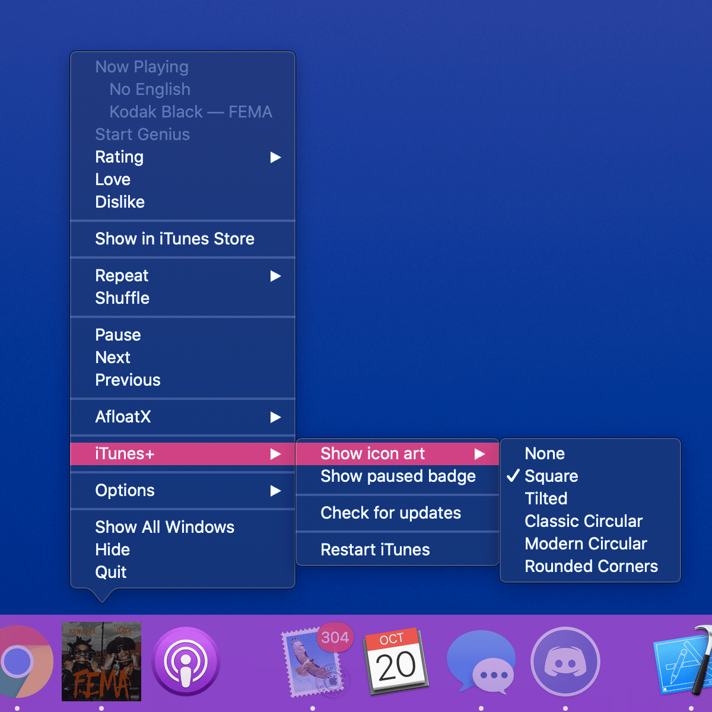

# iTunesPlus

 

# Information:

- Designed for macOS 10.9+
- Designed for iTunes 10.0+ and Music 1.0+
- iTunesPlus is a [MacForge](https://github.com/w0lfschild/MacForge) plugin that adds some features to iTunes and Music
    - Change the dock icon to the now playing track art
        - None
        - Square
        - Tilted square
        - Classic Circular
        - Modern Circular
    - Add badge to app icon when muted or paused
    - Restart iTunes/Music
    - Settings in Dock menu and iTunes+ item in the menubar
- Author: [w0lfschild](https://github.com/w0lfschild)

# Installation:

1. Download [MacForge](https://github.com/w0lfschild/app_updates/raw/master/MacForge/MacForge.zip)
2. Disable System Integrity Protection and Apple Mobile File Integrity : `sudo nvram boot-args="amfi_get_out_of_my_way=1"`
3. Reboot
4. Follw the link to Install [iTunesPlus](https://www.macenhance.com/mflink?macforge://github.com/w0lfschild/myRepo/raw/master/mytweaks/org.w0lf.iTunesPlus) using MacForge
5. Open iTunes or Music
